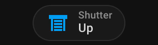

# Shutter Badge for Home Assistant

A custom Home Assistant badge to control shutters (e.g., roller shutters) directly from the dashboard. The badge allows for simple open and close operations with a user-friendly interface.



---

## Features

- Display a badge with a customizable label, icon, and color.
- Control the shutter's up and down movements by toggling associated `switch` entities.
- Automatically stops the shutter after a configurable duration (in seconds) for full open or close.

---

## Installation

To use this custom badge, you need to load the JavaScript file into your Home Assistant instance:

1. Open the **Dashboard Settings** (three-dot menu in the top-right corner of your dashboard).
2. Select **Resources**.
3. Add the following resource:

   ```yaml
   URL: https://cdn.jsdelivr.net/gh/gevgeny/shutter-badge/source/shutter-badge.js
   Type: JavaScript Module
   ```
4. Save and refresh the page.

---

## Configuration

Here’s an example YAML configuration to add the `shutter-badge` to your dashboard:

```yaml
- type: custom:shutter-badge
  label: Shutter               
  icon: mdi:window-shutter     
  color: var(--orange-color)   
  switch_up: switch.shellyplus2pm_2cbcaa388f54_switch_0   
  switch_down: switch.shellyplus2pm_2cbcaa388f54_switch_1 
  duration: 10                 
```

### Configuration Options

| Option        | Type     | Required | Default                | Description                                                |
| ------------- | -------- | -------- | ---------------------- | ---------------------------------------------------------- |
| `label`       | `string` | No       | `Shutter`              | Label to display on the badge.                             |
| `icon`        | `string` | No       | `mdi:window-shutter`   | Material Design icon for the badge.                        |
| `color`       | `string` | No       | `var(--primary-color)` | Badge color (CSS color or variable).                       |
| `switch_up`   | `string` | Yes      | -                      | Entity ID of the switch controlling the UP direction.      |
| `switch_down` | `string` | Yes      | -                      | Entity ID of the switch controlling the DOWN direction.    |
| `duration`    | `number` | No       | `10`                   | Time in seconds to keep the switch on for full open/close. |

---

## Example Use Case

### Add to Your Dashboard

1. Open your Home Assistant dashboard in **Edit Mode**.
2. Add a manual card with the YAML configuration above.
3. Save and enjoy controlling your shutters directly from the badge.

---

## Notes

- Ensure that the `switch_up` and `switch_down` entities are configured and functional in your Home Assistant instance.
- The `duration` option ensures that the switches automatically turn off after the specified time to prevent hardware damage.
- Customize the badge label, icon, and color to match your dashboard theme.

---

## Troubleshooting

If the badge does not work as expected:

1. Confirm that the resource URL has been added correctly in **Dashboard Settings > Resources**.
2. Verify that the `switch_up` and `switch_down` entities are valid and accessible.
3. Check the browser's developer console for any errors.

---

## License

This project is open-source and available under the [MIT License](LICENSE).

---

Enjoy seamless shutter control with your Home Assistant dashboard!

